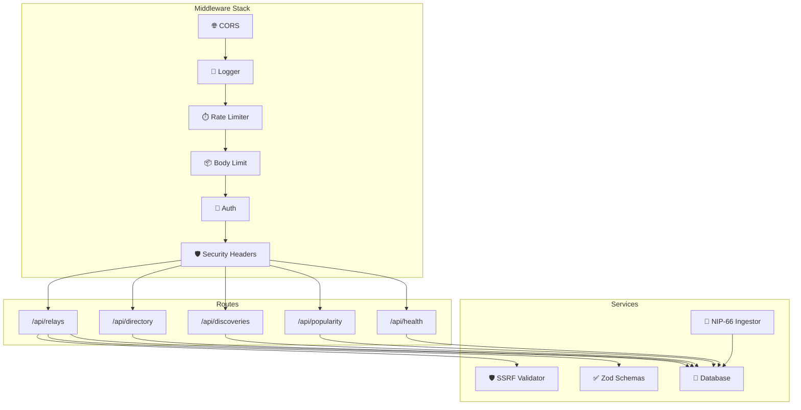

<p align="center">
  
  
  
  
</p>

<h1 align="center">⚡ API Overview</h1>

<p align="center">
  <strong>Hono HTTP server</strong> running on <strong>Bun</strong> with <strong>Drizzle ORM</strong> and <strong>PostgreSQL</strong>.
</p>

<p align="center">
  <a href="endpoints.md">Endpoints</a> · <a href="../architecture/database.md">Database</a> · <a href="../development/environment.md">Environment</a>
</p>

---

## 🏗️ Architecture



---

## 📁 File Structure

<details>
<summary><strong>Click to expand</strong></summary>

```
apps/api/
├── src/
│   ├── index.ts              # Entry point — env validation, server startup
│   ├── app.ts                # Hono app — mounts routes, middleware
│   ├── routes/
│   │   ├── relay/
│   │   │   ├── index.ts      # Relay route aggregator
│   │   │   ├── crud.ts       # GET/POST/PUT/DELETE /api/relays
│   │   │   ├── lookup.ts     # GET /api/relays/lookup
│   │   │   ├── health.ts     # POST /api/relays/:id/check
│   │   │   ├── history.ts    # GET /api/relays/:id/history
│   │   │   ├── nip11.ts      # GET /api/relays/:id/nip11
│   │   │   ├── discover.ts   # GET/POST /api/relays/:id/discoveries
│   │   │   └── popularity.ts # GET/POST /api/relays/:id/popularity
│   │   ├── directory.ts      # GET /api/directory, /countries, /compare
│   │   └── health.ts         # GET /api/health
│   ├── jobs/
│   │   ├── nip66Ingestor.ts  # Passive NIP-66 monitor subscriber
│   │   └── retentionCleanup.ts # Data retention cron
│   ├── lib/
│   │   ├── ssrf.ts           # URL safety validator
│   │   ├── schemas.ts        # Zod input schemas
│   │   ├── errors.ts         # Error categorization
│   │   └── log.ts            # Structured JSON logging
│   └── __tests__/
│       ├── api.test.ts       # API smoke tests
│       └── setup.ts          # Test environment setup
├── drizzle.config.ts         # (removed — now in packages/database/)
├── bunfig.toml               # Test preload config
├── package.json
└── tsconfig.json
```

</details>

---

## 🔧 Key Files

<table>
  <tr>
    <td width="50%" valign="top">

| File | Purpose |
|------|---------|
| `src/index.ts` | Server entry — env validation, `Bun.serve()` |
| `src/app.ts` | Hono app — routes, middleware, security |
| `src/routes/relay/crud.ts` | Relay CRUD operations |
| `src/routes/directory.ts` | Directory browse, filter, compare |
| `src/routes/relay/discover.ts` | NIP-66 discovery observations |
| `src/routes/relay/popularity.ts` | NIP-65 relay list entries |

    </td>
    <td width="50%" valign="top">

| File | Purpose |
|------|---------|
| `src/lib/ssrf.ts` | URL safety — blocks private/metadata |
| `src/lib/schemas.ts` | Zod validation schemas |
| `src/lib/errors.ts` | Error categorization |
| `src/jobs/nip66Ingestor.ts` | Passive NIP-66 subscriber |
| `src/__tests__/api.test.ts` | API smoke tests |

    </td>
  </tr>
</table>

---

## 🔐 Middleware Stack

| Middleware | Purpose | Config |
|------------|---------|--------|
| `cors` | Cross-origin requests | `CORS_ORIGINS` env var |
| `logger` | Request/response logging | Dev only |
| `rateLimiter` | Per-IP rate limits | 20 write / 200 read per min |
| `bodyLimit` | Request body cap | 100 KB max |
| `auth` | Bearer token auth | `API_KEY` env var |
| Security Headers | CSP, HSTS, etc. | Production only |

---

## 🏃 Running

```bash
# Development (watch mode)
cd apps/api
bun run dev

# Production
bun run build
bun run start
```

---

## 🔒 Security Features

| Feature | Description |
|---------|-------------|
| 🔑 API Key Auth | `POST`, `PUT`, `DELETE` require `Authorization: Bearer <API_KEY>` |
| 🛡️ SSRF Protection | All server-side URL fetches validated against private/loopback/cloud metadata |
| ⏱️ Rate Limiting | Per-IP, separate limits for read (200/min) and write (20/min) operations |
| ✅ Zod Validation | Strict input schemas on all create/update endpoints |
| 🔒 Mass Assignment | PUT only allows whitelisted fields |
| 🐳 Docker Isolation | PostgreSQL binds to `127.0.0.1` only |

---

## 🌍 Environment Variables

| Variable | Required (prod) | Default | Description |
|----------|-----------------|---------|-------------|
| `DATABASE_URL` | ✅ | — | PostgreSQL connection string |
| `API_KEY` | ✅ | — | Bearer token for mutating routes |
| `PORT` | ❌ | `3001` | Server port |
| `NODE_ENV` | ❌ | `development` | `development` or `production` |
| `CORS_ORIGINS` | ❌ | `localhost:5173` | Comma-separated allowed origins |
| `POSTGRES_PASSWORD` | ✅ (Docker) | — | PostgreSQL password |
| `MONITOR_RELAYS` | ❌ | `wss://relay-monitor.migalmoreno.com` | Comma-separated monitor relay URLs |

---

## 📚 Full API Reference

> [!TIP]
> See [API Endpoints](endpoints.md) for complete request/response examples with curl commands.

---

<p align="center">
  Made with ❤️ by <a href="https://github.com/SaadTayyab">Saad Tayyab</a>
</p>
