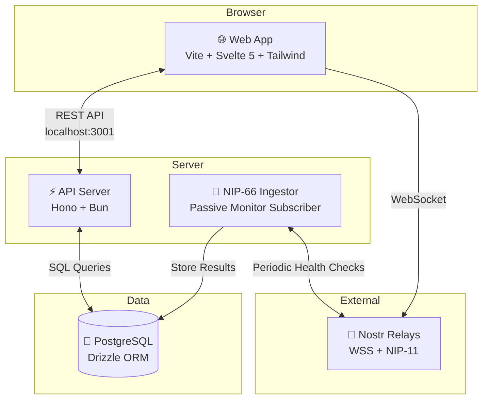
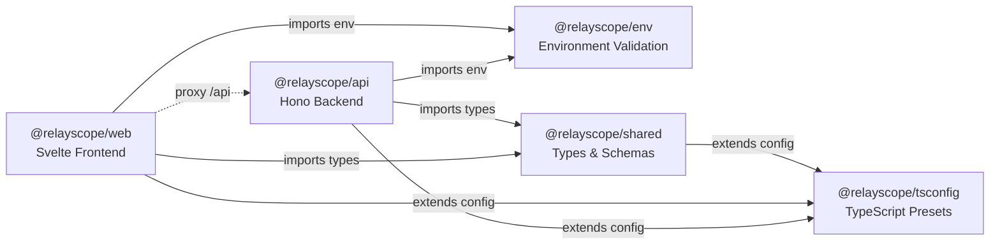
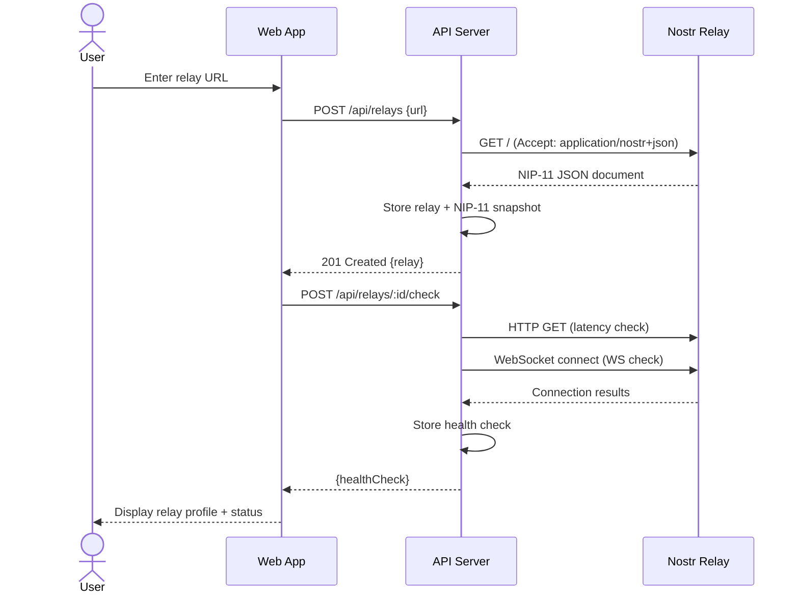
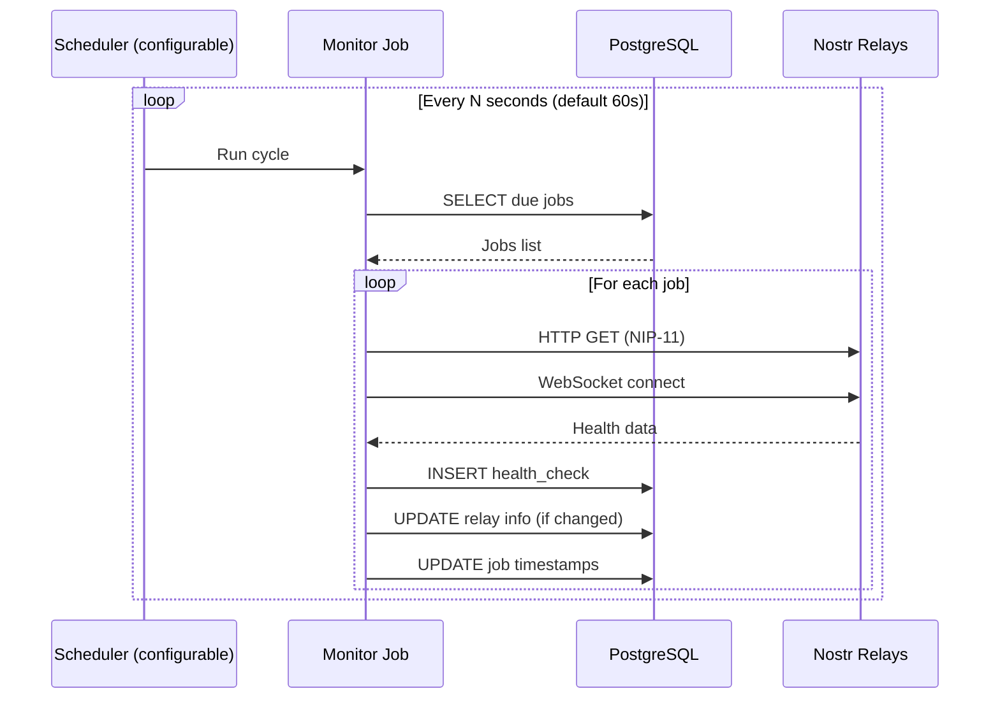
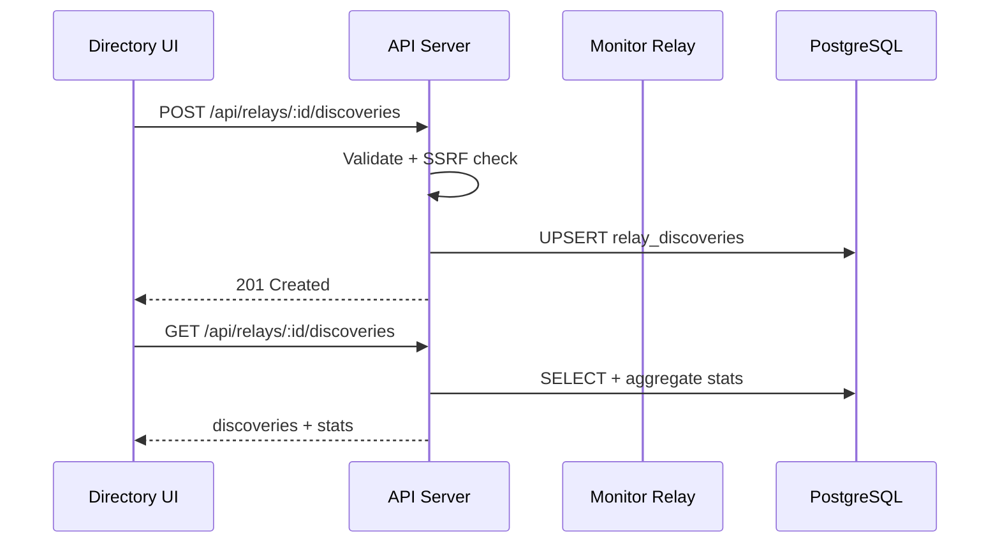

# 🏗️ System Architecture

## Overview

Relay Scope is a **Nostr relay inspector** — a browser-based tool for developers and power users to explore, verify, and monitor Nostr relays. Think "Postman meets Wireshark, for Nostr relays."

## High-Level Architecture

## Package Architecture

The monorepo contains five packages with clear dependency boundaries:

| Package | Stack | Responsibility |
|---------|-------|----------------|
| `@relayscope/web` | Vite + Svelte 5 + Tailwind v4 | Browser UI, NIP-11 viewer, connection checks, event tools |
| `@relayscope/api` | Hono + Bun + Drizzle ORM | REST API, relay CRUD, health checks, monitoring, directory |
| `@relayscope/shared` | TypeScript + Zod | Shared types, DTOs, entity interfaces, NIP validation schemas |
| `@relayscope/env` | TypeScript + Zod | Server/client environment parsing and validation |
| `@relayscope/tsconfig` | TypeScript configs | Shared TypeScript presets for Bun, Svelte, and base packages |

## Data Flow

### Relay Inspection Flow

### Background Monitoring Flow

### NIP-66 Discovery Flow

## Technology Decisions

| Decision | Choice | Rationale |
|----------|--------|-----------|
| Runtime | **Bun** | Native TypeScript, faster installs, built-in test runner |
| Monorepo | **Turborepo** | Incremental builds, task caching, workspace support |
| HTTP Framework | **Hono** | Lightweight, edge-ready, middleware ecosystem |
| ORM | **Drizzle** | SQL-like API, zero runtime overhead, Bun-optimized |
| Database | **PostgreSQL** | JSON support, array columns, mature ecosystem |
| Frontend | **Svelte 5 + Vite** | Compiler-based reactivity, Runes API for explicit state |
| CSS | **Tailwind v4** | Utility-first, custom theme tokens |
| Validation | **Zod 4** | Runtime type validation on API and shared schemas |
| Linting | **Biome** | Fast Rust-based linter + formatter |

## Security Considerations

- **CORS**: Configurable via `CORS_ORIGINS` env var (defaults to `localhost:5173`, `localhost:3000`)
- **API Key Auth**: Bearer token required on all mutating routes (`POST`, `PUT`, `DELETE`)
- **SSRF Protection**: `assertSafeUrl()` blocks private IPs, loopback, link-local, cloud metadata targets
- **Rate Limiting**: 20 write / 200 read requests per minute per IP
- **Input Validation**: Zod schemas on all create/update endpoints
- **Mass Assignment**: PUT only allows whitelisted fields (`name`, `description`, `isPublic`, `country`)
- **Timeouts**: All external fetches use `AbortSignal.timeout(10000)` to prevent hanging
- **Security Headers**: `X-Content-Type-Options`, `X-Frame-Options`, `Referrer-Policy`, `CSP`, `Permissions-Policy`, `HSTS` (production)
- **Body Size Limit**: 100 KB max request body
- **Production Error Handler**: Generic error messages; full details logged server-side only

## Scalability Notes

- **Current**: Single-server, suitable for development and small deployments
- **Horizontal**: Stateless API servers can scale behind a load balancer
- **Database**: Connection pooling via `postgres.js` (built-in pool)
- **Monitoring**: Sequential relay checks prevent thundering herd
- **Data Retention**: Daily cron cleans old health checks (90d), events (30d), snapshots (180d)
- **Caching**: Turborepo caches builds; consider Redis for API response caching in production

---

*See [Database Schema](database.md) for table details and [ADR-001](decisions/001-monorepo.md) for the monorepo decision.*

---

*Last updated: v0.9.0 — 2026-07-01*
